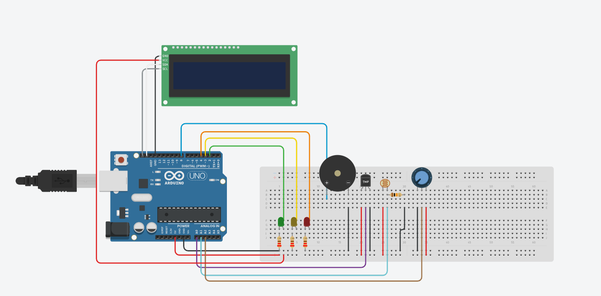
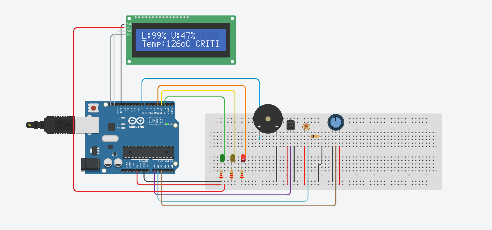

# Sistema IoT para Monitoramento de Cápsula Espacial

## Integrantes

* Nome completo do integrante 1 - RM
* Nome completo do integrante 2 - RM
* Nome completo do integrante 3 - RM

## Introdução

A exploração espacial exige sistemas altamente confiáveis para garantir a segurança dos astronautas, dos equipamentos e da operação de uma missão. Em uma cápsula espacial, fatores como temperatura, luminosidade e vibração precisam ser monitorados continuamente, pois alterações nesses parâmetros podem indicar falhas técnicas, impactos, superaquecimento, baixa visibilidade ou condições inadequadas para o funcionamento do módulo.

Nesse contexto, os sistemas embarcados e a Internet das Coisas desempenham um papel essencial. Por meio de sensores conectados a um microcontrolador, é possível coletar dados do ambiente, processá-los em tempo real e apresentar informações úteis para tomada de decisão.

Este projeto apresenta uma simulação de um sistema IoT para monitoramento de uma cápsula espacial, desenvolvido no Tinkercad com Arduino Uno. A solução realiza a leitura de temperatura, luminosidade e vibração, exibindo os dados em um display LCD e acionando alertas visuais e sonoros de acordo com o estado identificado.

## Objetivo do Projeto

O objetivo do projeto é desenvolver um sistema embarcado capaz de monitorar variáveis físicas essenciais para a operação segura de uma cápsula espacial simulada.

O sistema proposto realiza:

* Leitura da temperatura interna da cápsula;
* Leitura da luminosidade do ambiente;
* Simulação da vibração do módulo espacial;
* Exibição dos dados em tempo real em um display LCD;
* Classificação do estado do sistema em normal, atenção ou crítico;
* Acionamento de LEDs indicadores;
* Acionamento de buzzer em situações críticas.

A proposta busca demonstrar como sensores, atuadores e programação de microcontroladores podem ser utilizados em uma aplicação inspirada na indústria espacial.

## Componentes Utilizados

| Componente                         | Função no Projeto                                                                         |
| ---------------------------------- | ----------------------------------------------------------------------------------------- |
| Arduino Uno                        | Microcontrolador responsável por processar os dados dos sensores e controlar os atuadores |
| Protoboard                         | Base para montagem e conexão dos componentes eletrônicos                                  |
| Display LCD 16x2 com interface I2C | Exibe os dados de luminosidade, vibração, temperatura e estado do sistema                 |
| Sensor de temperatura TMP36        | Realiza a leitura da temperatura simulada da cápsula                                      |
| LDR                                | Mede a luminosidade do ambiente                                                           |
| Potenciômetro                      | Simula o nível de vibração da cápsula espacial                                            |
| LED verde                          | Indica estado normal de operação                                                          |
| LED amarelo                        | Indica estado de atenção                                                                  |
| LED vermelho                       | Indica estado crítico                                                                     |
| Buzzer                             | Emite alerta sonoro quando o sistema entra em estado crítico                              |
| Resistores                         | Limitam a corrente elétrica dos LEDs e do circuito                                        |
| Jumpers                            | Realizam as conexões entre os componentes                                                 |

## Desenvolvimento do Circuito

O circuito foi desenvolvido no Tinkercad utilizando o Arduino Uno como unidade central de processamento. Os sensores foram conectados às entradas analógicas do Arduino, permitindo que o sistema realize leituras contínuas das variáveis monitoradas.

O sensor TMP36 foi utilizado para representar a leitura de temperatura interna da cápsula. O LDR foi utilizado para medir a luminosidade, simulando alterações na iluminação do ambiente interno ou externo do módulo. O potenciômetro foi utilizado como recurso de simulação para representar diferentes níveis de vibração, já que o Tinkercad possui limitações em relação a sensores físicos específicos de vibração.

Os dados coletados são processados pelo Arduino e exibidos no display LCD 16x2. Além disso, o sistema utiliza três LEDs para indicar o estado atual da cápsula:

* LED verde: sistema em estado normal;
* LED amarelo: sistema em estado de atenção;
* LED vermelho: sistema em estado crítico.

Quando o sistema identifica uma condição crítica, o buzzer é acionado para representar um alerta sonoro de emergência.

## Lógica de Funcionamento

O sistema realiza leituras constantes dos sensores e converte os valores analógicos para escalas mais compreensíveis.

As variáveis monitoradas são:

* Luminosidade, exibida em porcentagem;
* Vibração, exibida em porcentagem;
* Temperatura, exibida em graus Celsius.

A partir dessas leituras, o sistema classifica a situação da cápsula em três estados.

### Estado Normal

O estado normal ocorre quando os valores estão dentro da faixa considerada segura:

* Luminosidade maior ou igual a 95%;
* Vibração menor ou igual a 50%;
* Temperatura entre 20 °C e 30 °C.

Nesse estado, o LED verde permanece aceso e o display mostra a mensagem `NORMAL`.

### Estado de Atenção

O estado de atenção ocorre quando alguma variável começa a se aproximar de uma faixa de risco, mas ainda não representa uma situação crítica.

Condições de atenção:

* Luminosidade abaixo de 95%;
* Vibração acima de 50%;
* Temperatura entre 31 °C e 35 °C;
* Temperatura entre 15 °C e 19 °C.

Nesse estado, o LED amarelo é acionado e o display mostra a mensagem `ATENCAO`.

### Estado Crítico

O estado crítico ocorre quando alguma variável ultrapassa os limites seguros definidos no sistema.

Condições críticas:

* Luminosidade abaixo de 25%;
* Vibração acima de 80%;
* Temperatura acima de 35 °C;
* Temperatura abaixo de 15 °C.

Nesse estado, o LED vermelho é acionado, o buzzer emite um alerta sonoro e o display mostra a mensagem `CRITICO`.

## Código Desenvolvido

O código foi desenvolvido em linguagem C/C++ para Arduino. Ele utiliza a biblioteca `Adafruit_LiquidCrystal` para controle do display LCD.

### Inicialização do display

```cpp
#include <Adafruit_LiquidCrystal.h>
Adafruit_LiquidCrystal lcd(0);
```

Esse trecho importa a biblioteca responsável pelo funcionamento do display LCD e cria o objeto `lcd`, utilizado para exibir as informações no visor.

### Definição dos componentes

```cpp
int led_vd = 2;
int led_am = 3;
int led_vm = 4;
int buzzer = 8;

int tmp = A0;
int ldr = A1;
int pot = A2;
```

Nesse trecho são definidos os pinos utilizados pelos LEDs, buzzer e sensores. Os LEDs e o buzzer utilizam pinos digitais, enquanto os sensores utilizam entradas analógicas.

### Configuração inicial

```cpp
void setup()
{
    Serial.begin(9600);
  
    pinMode(led_vd, OUTPUT);
    pinMode(led_am, OUTPUT);
    pinMode(led_vm, OUTPUT);
    pinMode(buzzer, OUTPUT);

    lcd.begin(16, 2);					
    lcd.print("Iniciando...");
    delay(1000);
  
    lcd.clear();
}
```

Na função `setup()`, são configurados os pinos de saída e inicializado o display LCD. A mensagem `Iniciando...` é exibida ao ligar o sistema.

### Leitura dos sensores

```cpp
int luz = map(analogRead(ldr), 54, 974, 0, 100);
int vibracao = map(analogRead(pot), 0, 1023, 0, 100);
int temperatura = map(analogRead(tmp), 20, 358, -40, 126);
```

A função `analogRead()` realiza a leitura dos sensores conectados às portas analógicas. Em seguida, a função `map()` converte esses valores para escalas mais compreensíveis, como porcentagem de luminosidade, porcentagem de vibração e temperatura em graus Celsius.

### Exibição dos dados no display

```cpp
lcd.setCursor(0, 0);
lcd.print("L:");
lcd.print(luz);
lcd.print("% ");

lcd.print("V:");
lcd.print(vibracao);
lcd.print("%");

lcd.setCursor(0, 1);
lcd.print("Temp:");
lcd.print(temperatura);
lcd.print((char)223);
lcd.print("C ");
```

Esse trecho exibe no display os valores de luminosidade, vibração e temperatura. A primeira linha mostra luminosidade e vibração, enquanto a segunda linha mostra a temperatura e o estado atual do sistema.

### Condição crítica

```cpp
if(luz < 25 || vibracao > 80 || temperatura > 35 || temperatura < 15){
    digitalWrite(led_vd, LOW);
    digitalWrite(led_am, LOW);
    digitalWrite(led_vm, HIGH);
    
    lcd.print("CRITICO ");
    
    tone(buzzer, 800, 1000);
    delay(250);
    noTone(buzzer);
}
```

Se qualquer variável atingir uma condição crítica, o LED vermelho é ligado e o buzzer é acionado. Essa lógica representa uma situação de emergência na cápsula espacial.

### Condição de atenção

```cpp
else if(luz < 95 || vibracao > 50 || temperatura > 30 && temperatura <= 35 || temperatura < 20 && temperatura >= 15){
    digitalWrite(led_vd, LOW);
    digitalWrite(led_am, HIGH);
    digitalWrite(led_vm, LOW);
    
    lcd.print("ATENCAO ");
    
    delay(250);
}
```

Se alguma variável estiver fora da condição ideal, mas ainda não estiver em nível crítico, o sistema aciona o LED amarelo e exibe a mensagem `ATENCAO`.

### Condição normal

```cpp
else if(luz >= 95 && vibracao <= 50 && temperatura <= 30 && temperatura >= 20){
    digitalWrite(led_vd, HIGH);
    digitalWrite(led_am, LOW);
    digitalWrite(led_vm, LOW);
    
    lcd.print("NORMAL ");
    
    delay(250);
}
```

Quando todos os valores estão dentro da faixa segura, o LED verde é ligado e o display mostra a mensagem `NORMAL`.

## Resultados Obtidos

Durante a simulação no Tinkercad, o sistema apresentou funcionamento contínuo e leitura em tempo real das variáveis monitoradas.

Os resultados observados foram:

* O display LCD exibiu corretamente os valores de luminosidade, vibração e temperatura;
* O LED verde foi acionado quando o sistema estava em condição normal;
* O LED amarelo foi acionado quando alguma variável entrou em faixa de atenção;
* O LED vermelho foi acionado em situações críticas;
* O buzzer emitiu alerta sonoro quando os limites críticos foram ultrapassados;
* A alteração dos valores simulados nos sensores gerou respostas automáticas no sistema.

A simulação demonstrou que o sistema é capaz de coletar, processar e exibir dados em tempo real, além de alertar sobre possíveis riscos operacionais em uma cápsula espacial.

## Imagens da Simulação

### Circuito completo

Inserir aqui o print do circuito completo no Tinkercad.

```markdown

```

### Display em funcionamento

Inserir aqui um print do display exibindo os dados monitorados.

```markdown

```

### Estado crítico

Inserir aqui um print demonstrando o LED vermelho ou buzzer em situação crítica.

```markdown

```

## Melhorias Futuras

Como melhorias futuras, o projeto poderia incluir:

* Substituição do potenciômetro por um sensor real de vibração ou acelerômetro;
* Inclusão de um sensor de pressão atmosférica;
* Envio dos dados para uma plataforma IoT em nuvem;
* Criação de um dashboard para acompanhamento remoto da missão;
* Registro histórico das medições para análise posterior;
* Implementação de comunicação sem fio com uma central de controle;
* Uso de ESP32 para conexão com redes Wi-Fi;
* Criação de alertas automáticos para diferentes níveis de risco.

Essas melhorias tornariam o sistema mais próximo de uma aplicação real de monitoramento espacial.

## Conclusão

O projeto demonstrou a viabilidade de um sistema IoT para monitoramento de uma cápsula espacial simulada. Utilizando Arduino, sensores, display LCD, LEDs e buzzer, foi possível desenvolver uma solução funcional capaz de coletar dados físicos, processá-los em tempo real e emitir alertas automáticos.

A solução está alinhada aos conceitos de sistemas embarcados, sensores e atuadores, programação de microcontroladores, aquisição de dados e monitoramento em tempo real. Além disso, o projeto se conecta à indústria espacial ao simular uma aplicação voltada à segurança operacional de módulos espaciais.

Com os resultados obtidos, foi possível compreender a importância da integração entre hardware e software em sistemas críticos, especialmente em ambientes onde o monitoramento contínuo é essencial para a tomada de decisão.

## Links do Projeto

* Projeto no Tinkercad: inserir link aqui
* Vídeo no YouTube: inserir link aqui
* Repositório GitHub: inserir link aqui

## Arquivos do Repositório

```text
/
├── README.md
├── codigo.ino
├── assets/
│   ├── circuito-completo.png
│   ├── display-funcionando.png
│   └── estado-critico.png
└── relatorio.pdf
```

## Tecnologias Utilizadas

* Arduino
* Tinkercad
* Linguagem C/C++ para Arduino
* Display LCD 16x2
* Sensores analógicos
* Sistemas embarcados
* Simulação de Internet das Coisas
